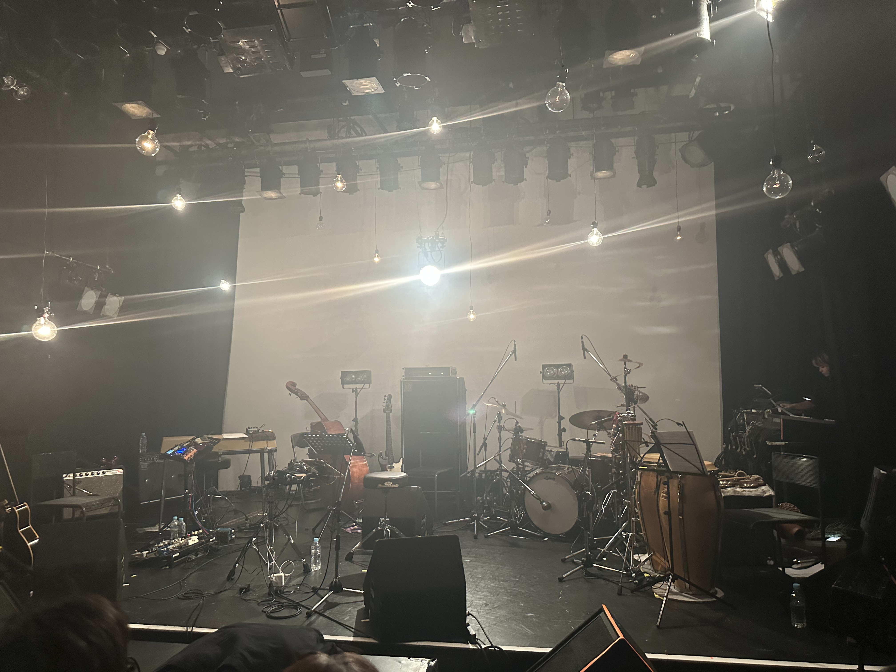

岡田拓郎は、去年発表したアルバム「Konoma」で一気に評価されるようになった印象がある。そして、ライブは音源を遥かに超える感動だった。Dub、Reggae、ジャズ、民謡を自由に行き来しながら、六人の息が混ざり合うようなライブだった。特にサックスとベースの力強さは素晴らしい。

maya ongakuのライブも良かった。実験音楽においてシンセサイザーの良い使い方が見られた。

日本の民謡だけでなく、各国の民謡の生命力の深さが垣間見えた。そういえば、「Konoma」も「民藝」が一つのテーマになっているよね。

[岡田拓郎、新作『Konoma』で得た過去と未来への気づき](https://turntokyo.com/features/interview-takuro-okada-konoma/)